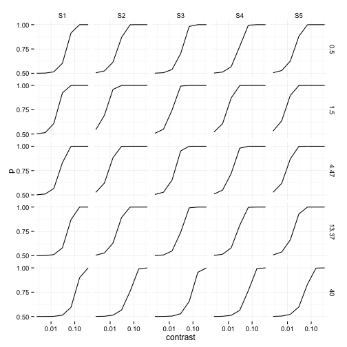

# Graphically exploring data using ggplot2

Your second step after importing should always be to *look at the data*. That means plotting lots of things, and getting a sense of how everything fits together. *Never* run a statistical test until you've looked at your data in as many ways as you can. Doing so can give you good intuitions about whether the comparisons you planned make sense to do, and whether any unexpected relationships are apparent in the data. The best tool for reproducible data exploration that I have used is Hadley Wickham's ``ggplot2`` package.

## A brief introduction to the mindset of ggplot

The first thing to note about ``ggplot2`` is that it is better thought of as a data exploration tool than a plotting package (like base graphics in Matlab, R, or Python). In those systems, you typically create an x variable and a y variable, then plot them as something like a line, then maybe add a new line in a different colour. ``ggplot`` tries to separate your data from how you display it by making links between the data and the visual representations explicit, including any transformations. There's a little introduction to this philosophy [here](http://tomhopper.me/2014/03/28/a-simple-introduction-to-the-graphing-philosophy-of-ggplot2/). 

For me, what this means in practice is that you need to start thinking in terms of _long format data frames_ rather than separate x- and y vectors. A long format data frame is one where each value that we want on the y-axis in our plot is in a separate row ([see wiki article here](https://en.wikipedia.org/wiki/Wide_and_narrow_data)). The Cookbook for R has some good recipes for going between wide and long format data frames [here](http://www.cookbook-r.com/Manipulating_data/Converting_data_between_wide_and_long_format/). For example, imagine we have measured something (say, reaction time) in a within-subjects design where the same people performed the task under two conditions. For ggplot we want a data frame with columns like: 

subject   | condition | rt
--------  | --------  | ----
s1        | A         | 373
s1        | B         | 416
s2        | A         | 360
s2        | B         | 387

not like:

subject   | rt conditionA | rt conditionB
--------  | --------  | ----
s1        | 373         | 416
s2        | 360         | 387

or like (familiar to anyone plotting with Matlab or Matplotlib):

```
x = [s1, s2]
y_1 = [373, 360]
y_2 = [416, 387]
```

For the first few weeks of using ggplot2 I found this way of thinking about data took some getting used to, particularly when trying to do things as I'd done in Matlab. However, once you make the mental flip, the ggplot universe will open up to you. 

## Contrast detection data example

Now we will look at the data from [my data import](http://tomwallis.info/2014/03/26/data-import-in-r/) post. This consists of data from a psychophysical experiment where five subjects detected sine wave gratings at different contrasts and spatial frequencies. You can download the data from my github repository [here](https://github.com/tomwallis/blog_stuff). For each trial, we have a binary response (grating left or right) which is either correct or incorrect. Each row in the data frame is a trial, which means that this is already in _long format_:


```r
# load(paste0(getwd(),'/out/contrast_data.RData'))
load(paste0(getwd(), "/../", "/out/contrast_data.RData"))  # need to go up a level when running from blog_posts subdir.
head(dat)
```

```
##   subject contrast     sf target_side response
## 1      S1 0.069483  0.500       right    right
## 2      S1 0.013124 40.000       right     left
## 3      S1 0.069483  4.472        left     left
## 4      S1 0.069483 40.000        left    right
## 5      S1 0.367879 13.375        left     left
## 6      S1 0.002479  0.500        left    right
##                              unique_id correct
## 1 544ee9ff-2569-4f38-b04e-7e4d0a0be4d2       1
## 2 b27fe910-e3ba-48fb-b168-5afb1f115d8f       0
## 3 72c9d6ce-0a90-4d4b-a199-03435c15291b       1
## 4 48b5bbb2-e6ee-4848-b77e-839ed5320c01       0
## 5 32a5cce4-3f8a-4e63-80c1-3fee3230d1bd       1
## 6 47ebce53-9d5a-48de-936b-25d5105a0784       0
```


### Baby steps

Building a plot in `ggplot2` starts with the `ggplot()` function:


```r
library(ggplot2)
fig <- ggplot(data = dat, aes(x = contrast, y = correct))
```


This command creates `fig`, which is a ggplot object, in our workspace. We've specified the data frame to use (`dat`), and two "aesthetics" using the `aes()` function. Aesthetics are how ggplot assigns variables in our data frame to things we want to plot. In this example we have specified that we want to plot `contrast` on the x-axis and `correct` on the y-axis.

We can try plotting this just by typing `fig` into the command window:

```r
fig
```

```
## Error: No layers in plot
```


but this returns an error because we haven't specified how we want to display the data. We must add a `geom` to the `fig` object (note the iterative notation, where we overwrite the fig object with itself plus the new element):


```r
fig <- fig + geom_point()
fig
```

 


Now we get a plot of the data, with each correct trial as a point at `1` and each incorrect trial as a point at `0`. But that's not very informative, because there's a lot of overplotting -- we're really interested in how often the subjects get the trials correct at each contrast level. That is, we want to know the proportion of correct responses. 

To do that we could create a new data frame where we compute the mean of all `correct` values for each cell of our experiment (i.e. for each subject, at each level of contrast and spatial frequency). However, it's also possible for ``ggplot2`` to do that for us as we plot, using the `stat_summary` command:


```r
fig <- fig + stat_summary(fun.data = "mean_cl_boot", colour = "red")
fig
```

 


The `mean_cl_boot` command computes the means and bootstrapped 95% confidence intervals on the mean, for all the y-values falling into each unique x-value. These are shown as the red points in the above plot. Type `?stat_summary` and look at the examples (or run `example(stat_summary)` to get an idea of what you can do out-of-the-box with this command. It also allows you to define your own functions to summarise the y values for each value of x, so it's incredibly flexible.

Since the contrast values in our experiment were sampled logarithmically, the values for all the small contrasts are all squished up to the left of the plot. Therefore, the last thing we might want to do with this basic plot is to log scale the x-axis: 


```r
fig <- fig + scale_x_log10()
fig
```

 


Now we can see that the mean proportion correct starts from 0.5 for low contrasts (i.e. 50% correct, or chance performance on the task) and gradually rises up to near 100% correct in an S-shaped fashion.

### Facets and smooths

The goal of this experiment was to see whether and how human visual sensitivity to contrast changes depending on the spatial scale of the information (loosely, whether the pattern is _coarse_ or _fine_). While the basic data representation makes sense (i.e. looking at proportion correct), the plot above is not very useful because it averages over all the different subjects and over the experimental variable we're most interested in (spatial frequency). Thus it doesn't tell us anything about the goal of the experiment.

Here's where `ggplot2` gets really cool. We can apply the same basic plot to each subset of the data we're interested in, in one line of code, by using _faceting_. First, here's the basic plot again, but in a more succinct form (note how I string together subfunctions using the `+` sign across multiple lines):


```r
fig <- ggplot(data = dat, aes(x = contrast, y = correct)) + stat_summary(fun.data = "mean_cl_boot") + 
    scale_x_log10() + scale_y_continuous(limits = c(0, 1))
fig
```

 


Now we want to do the same thing, but look at the data for each subject and spatial frequency separately. The `facet_grid` command allows us to lay out the data subsets on a grid. Since we want to compare how the performance shifts as a function of contrast _within_ each subject, it makes sense to arrange the facets with subjects in each column and spatial frequencies in the rows. This is done by adding one element to the `fig` object above:


```r
fig <- fig + facet_grid(sf ~ subject)  # specifies rows ~ columns of the facet_grid.
fig
```

 


Now we get a replication of the basic x-y plot but for each subject and spatial frequency. The axes have been scaled identically by default so it's easy to see variation across the facets. If you follow down each column, you can see that performance as a function of contrast first improves and then gets worse again, relative to the first spatial frequency (0.5 cycles of the grating per degree of visual angle). To see this more clearly it will help to add trend lines, which again we can do in one line in ggplot2:


```r
fig <- fig + stat_smooth(method = "glm", family = binomial())
fig
```

 


In this case I've used a Generalised Linear Model specifying that we have binomial data (this defaults to a logistic link function). The blue lines show the maximum likelihood model prediction and the grey shaded regions show the 95% confidence limits on these predictions. However, this model isn't taking account of the fact that we know performance will asymptote at 0.5 (because this is chance performance on the task), so the slopes look all wrong. A psychophysicist would now fit this model with a custom link function that asymptotes at 0.5. Such link functions are implemented in Ken Knoblauch's [`psyphy` package for R](http://cran.r-project.org/web/packages/psyphy/index.html).

We could implement that within `ggplot2` as well, but instead here I will use a Generalised Additive Model (GAM) to show more flexible fitting of splines. This could come in handy if you didn't have a good approximation for the functional form for your dataset (i.e. you have only vague expectations for what the relationship between x and y should be).


```r
library(mgcv)
```

```
## Loading required package: nlme
## This is mgcv 1.7-28. For overview type 'help("mgcv-package")'.
```

```r
fig <- fig + stat_smooth(method = "gam", family = binomial(), formula = y ~ 
    s(x, bs = "cs", k = 3), colour = "red")
fig
```

 


The above code fits a cubic spline ("cs") with three knots ("k=3"). Essentially this is a really flexible way to consider nonlinear univariate relationships (a bit like polynomial terms in normal GLMs). You can see that these data are probably overfit (i.e. the model is capturing noise in the data and is unlikely to generalise well to new data), and some of the confidence regions are pretty crazy (because the model is so flexible and the data are not well sampled for the observer's sensitivity) but that it gives a reasonable impression for the purposes of exploration. If you scan down the columns for each subject, you can see that the point on the x-axis where the red curves have the steepest slope is furthest to the left for spatial frequencies of 1.5 and 4.5 cycles per degree. These observers reach a higher level of performance with less contrast than in the other conditions: their thresholds are lower. Humans are most sensitive to contrast in the 1--4 cycles per degree range ([Campbell and Robson, 1968](http://www.ncbi.nlm.nih.gov/pmc/articles/PMC1351748/)).

### Appearance matters

Finally, we can adjust the appearance of our plot. First, let's get rid of the ugly decimal-point labels in the spatial frequency dimension by creating a new variable, a factor of sf:


```r
dat$sf_factor <- factor(dat$sf)
levels(dat$sf_factor) <- round(sort(unique(dat$sf)), digits = 1)  # rename levels
```


Second, some people don't like the grey background theme of the ggplot default. It took me a little while to get used to, but now I quite like it: by attending to things that are darker than the background you can concentrate on the data, but the gridlines are there if you need them. However, if you prefer a more traditional plot, just add the classic theme (`fig + theme_classic()`). Personally my favourite is now `theme_minimal()`. So having done all this, our entire plot call becomes:


```r
fig <- ggplot(data = dat, aes(x = contrast, y = correct)) + facet_grid(sf_factor ~ 
    subject) + stat_summary(fun.data = "mean_cl_boot") + stat_smooth(method = "gam", 
    family = binomial(), formula = y ~ s(x, bs = "cs", k = 3)) + scale_x_log10(name = "Contrast") + 
    scale_y_continuous(name = "Proportion Correct", limits = c(0, 1), breaks = c(0, 
        0.5, 1)) + theme_minimal()
fig
```

 


## Going further with ggplot2

What would happen if we wanted to see whether performance changed depending on the side of the retina (left or right of fixation) the grating was presented? Perhaps sensitivity is different, or the person has a bias in responding to a side. We can look at this by simply adding a new argument in the `aes()` function when we call `ggplot`: `colour = target_side`. Try it at home! There's an example of doing this in the `plots.R` script on [my github page](https://github.com/tomwallis/blog_stuff). Here you can also see how the plots are saved to the `/figs` subdirectory, where a document file (like a `.tex` doc) can be set up to automatically pull in the figures.

This post was just a little taste of what you can do in ggplot2, with a focus on vision science data. There are many more thorough introductions for ``ggplot2`` available on the web, like [here](http://blog.echen.me/2012/01/17/quick-introduction-to-ggplot2/) and [here](http://www.noamross.net/blog/2012/10/5/ggplot-introduction.html). I find that [The Cookbook for R](http://www.cookbook-r.com/) has heaps of useful little tips and code snippets, as well as showing you lots of basic ggplot things in the plotting section. If you want an example of some published figures made with `ggplot2` as well as the code that generated them, you can see our recent paper [here](https://github.com/tomwallis/microperimetry_faces).
